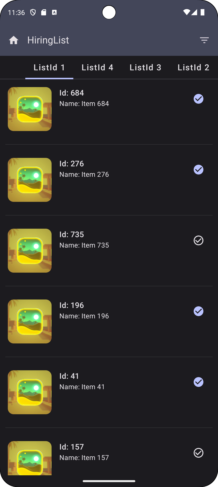

# Android MVVM Compose 

## Features
#### Used MVVM Architecture
#### Used Jetpack Compose UI
#### Used Kotlin And Coroutine
#### Used Mockito for unit testing 
#### Used Hilt for Dependency Injection
#### Used Retrofit for network requests

## Light Mode

## Dark Mode

### Demo Video for Sort ListId and Name

| Dark Theme | Light Theme | 
|------------|-------------|
|  |  |

|  Demo |
| -------------|
|  |
