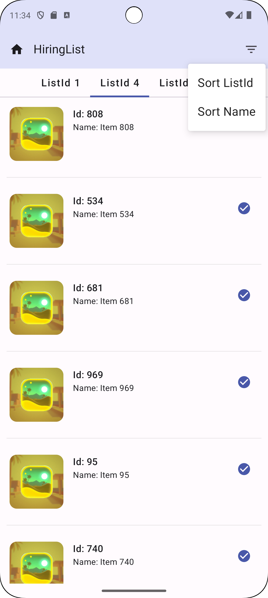
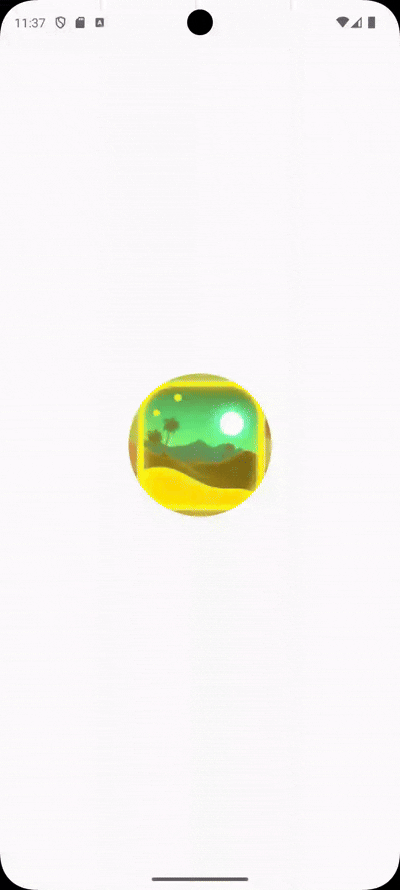
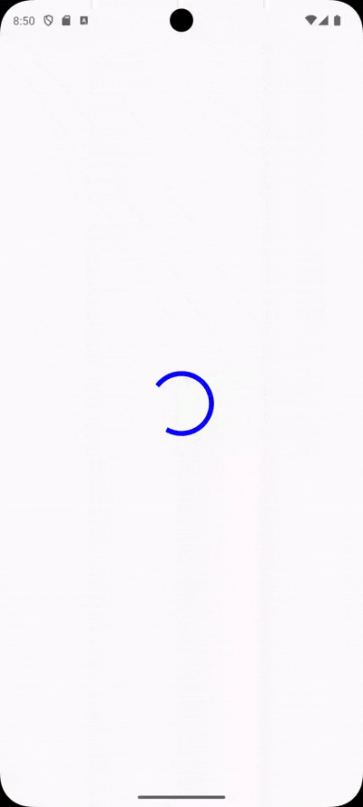

# Android MVVM Compose 

## Features
- Used MVVM Architecture
- Used Jetpack Compose UI
- Used Kotlin And Coroutine
- Used Mockito for unit testing 
- Used Hilt for Dependency Injection
- Used Retrofit for network request

## Light Mode

| Light Theme | Light Theme Sort menu | 
|------------|-------------|
|  |  |
## Dark Mode

| Dark Theme |  
|------------|
|  | 

## Dark Mode

| Demo sort Listid and name | Demo Eorror/reload when wifi off/on |
|-------------------|-------------|
|  |  |

